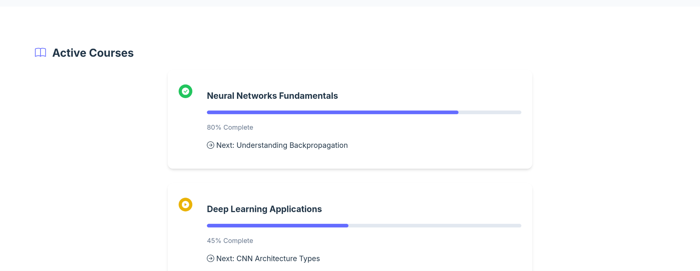

# AI Learning Platform

An innovative educational platform that leverages artificial intelligence to deliver personalized learning experiences. Built with Django and HTMX for seamless, modern interactions.




*Main dashboard showing personalized learning recommendations and progress tracking*

## 🚀 Features

### Smart Content Recommendations
- AI-powered system that suggests relevant learning materials based on student performance and learning style
- Real-time adaptation to student progress and comprehension levels
- Personalized content delivery optimized for maximum engagement

### Adaptive Learning Paths
- Dynamic pathway generation based on individual learning patterns
- Automatic difficulty adjustment to maintain optimal challenge levels
- Customized pacing to ensure thorough understanding before progression

### Progress Tracking & Analytics
- Comprehensive dashboard for monitoring learning progress
- Detailed performance metrics and engagement statistics
- Visual representation of learning trajectories and milestones

### Interactive Exercises
- Real-time feedback system for immediate learning reinforcement
- Collaborative learning features for peer-to-peer interaction
- Gamified elements to enhance engagement and motivation

## 📈 Learning Outcomes

Our platform has demonstrated significant improvements in educational effectiveness:

- 30% improvement in overall learning efficiency
- Consistently high user satisfaction ratings
- Marked increase in student engagement metrics
- Enhanced knowledge retention rates

## 🛠 Technical Stack

### Backend
- **Framework:** Django with HTMX for dynamic interactions
- **Database:** PostgreSQL for robust data persistence
- **AI Integration:** Hugging Face transformers for intelligent features
- **Caching:** Redis for optimized performance

### Key Technologies
- Python
- Django
- PostgreSQL
- Hugging Face
- Redis

## 🚀 Getting Started

1. Clone the repository:
```bash
git clone https://github.com/yourusername/ai-learning-platform.git
```

2. Install dependencies:
```bash
pip install -r requirements.txt
```

3. Set up environment variables:
```bash
cp .env.example .env
# Edit .env with your configuration
```

4. Run migrations:
```bash
python manage.py migrate
```

5. Start the development server:
```bash
python manage.py runserver
```

## 🤝 Contributing

We welcome contributions to improve the platform! Please follow these steps:

1. Fork the repository
2. Create a feature branch
3. Commit your changes
4. Push to the branch
5. Open a Pull Request

## 📄 License

This project is licensed under the MIT License - see the [LICENSE.md](LICENSE.md) file for details.

## 📬 Contact

For questions or support, please reach out to:
- Email: support@ailearningplatform.com
- GitHub Issues: [Create an issue](https://github.com/yourusername/AIducate/issues)

